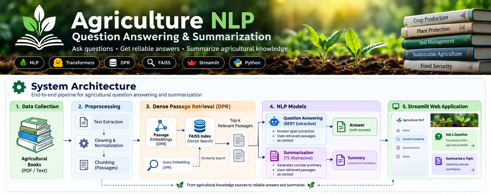

\# 🌱 Agriculture NLP — Question Answering \& Summarization


<p align="center">

&#x20; 

</p>


<p align="center">

&#x20; <strong>NLP-based question answering and topic summarization for agricultural books.</strong>

</p>


<p align="center">

&#x20; 

&#x20; 

&#x20; 

&#x20; 

&#x20; 

&#x20; 

</p>


\---


\## 📌 Overview


This project implements a natural language processing system for \*\*question answering and topic summarization\*\* over a collection of agriculture-related e-books from Project Gutenberg.


The system combines:


\- \*\*Dense Passage Retrieval (DPR)\*\* for semantic retrieval

\- \*\*FAISS\*\* for vector similarity search

\- \*\*BERT-QA\*\* for extractive question answering

\- \*\*T5-small\*\* for abstractive summarization

\- \*\*Streamlit\*\* for the interactive web application


The project was developed as a practical implementation of a retrieval-based NLP pipeline using pretrained transformer models.


\---


\## ✨ Features


| Feature | Description |

|---|---|

| 🔎 Semantic Retrieval | DPR retrieves passages based on semantic similarity |

| 📚 Multi-book Search | Searches across six agriculture e-books |

| ❓ Question Answering | BERT extracts answers directly from retrieved passages |

| 📝 Topic Summarization | T5 generates concise summaries of retrieved content |

| 🗂️ Vector Search | FAISS provides efficient similarity search |

| 🌐 Interactive UI | Streamlit provides a simple browser-based interface |

| 📖 Source Display | Retrieved passages and source books are shown to the user |


\---


\## 🏗️ System Architecture


<p align="center">

&#x20; 

</p>


\### Pipeline


```text

Agricultural Books

&#x20;      │

&#x20;      ▼

Preprocessing \& Cleaning

&#x20;      │

&#x20;      ▼

Passage Creation

(200 words, 50-word overlap)

&#x20;      │

&#x20;      ▼

DPR Context Encoder

&#x20;      │

&#x20;      ▼

FAISS Vector Index

&#x20;      │

&#x20;      │  Query

&#x20;      ▼

DPR Question Encoder

&#x20;      │

&#x20;      ▼

Top-k Relevant Passages

&#x20;      │

&#x20;      ├──────────────────────────┐

&#x20;      │                          │

&#x20;      ▼                          ▼

&#x20;  BERT-QA                    T5-small

&#x20;  Extractive                Abstractive

&#x20;  Answering                 Summarization

&#x20;      │                          │

&#x20;      ▼                          ▼

&#x20;    Answer                    Summary

&#x20;      │                          │

&#x20;      └──────────┬───────────────┘

&#x20;                 ▼

&#x20;         Streamlit Web App

```


\---


\## 📚 Dataset


The system uses \*\*six unique agriculture books\*\* from Project Gutenberg:


1\. \*\*Agriculture for Beginners\*\*  

&#x20;  Charles William Burkett, Frank Lincoln Stevens, and Daniel Harvey Hill


2\. \*\*Science and Practice in Farm Cultivation\*\*  

&#x20;  James Buckman


3\. \*\*The Farm That Won't Wear Out\*\*  

&#x20;  Cyril G. Hopkins


4\. \*\*Dry-Farming: A System of Agriculture for Countries under a Low Rainfall\*\*  

&#x20;  John Andreas Widtsoe


5\. \*\*Pleasant Talk About Fruits, Flowers and Farming\*\*  

&#x20;  Henry Ward Beecher


6\. \*\*Field, Forest and Farm\*\*  

&#x20;  Jean-Henri Fabre


One of the original assignment links was duplicated, resulting in six unique books.


\### Dataset processing


The original Project Gutenberg texts are:


\- cleaned

\- normalized

\- divided into overlapping passages

\- converted into DPR embeddings


The final dataset contains approximately \*\*2,973 passages\*\*.


Each passage contains approximately \*\*200 words\*\*, with a \*\*50-word overlap\*\* between consecutive passages.


\---


\## 🧹 Preprocessing


The preprocessing pipeline removes common Project Gutenberg formatting and metadata while preserving the actual book content.


Main steps include:


1\. Remove Project Gutenberg start/end markers

2\. Remove production and transcription notes

3\. Remove formatting artifacts

4\. Normalize whitespace

5\. Preserve the book text

6\. Split the cleaned text into overlapping passages


Implementation:


```text

src/preprocess.py

src/chunk\_books.py

```


\---


\## 🔎 Dense Passage Retrieval


The project uses \*\*Dense Passage Retrieval (DPR)\*\* to retrieve passages relevant to a user's question or topic.


Two DPR encoders are used:


```text

facebook/dpr-question\_encoder-single-nq-base

facebook/dpr-ctx\_encoder-single-nq-base

```


The passage encoder converts each passage into a \*\*768-dimensional dense vector\*\*.


The question encoder converts the user's query into the same vector space.


FAISS then searches the passage vectors using normalized inner-product similarity, which corresponds to cosine similarity.


\### Retrieval flow


```text

User Question / Topic

&#x20;       │

&#x20;       ▼

DPR Question Encoder

&#x20;       │

&#x20;       ▼

Question Embedding

&#x20;       │

&#x20;       ▼

FAISS Similarity Search

&#x20;       │

&#x20;       ▼

Top-k Relevant Passages

```


The generated index is stored in:


```text

data/dpr\_passages.faiss

```


Passage metadata is stored in:


```text

data/dpr\_metadata.pkl

```


\---


\## ❓ Question Answering


The Question Answering pipeline combines DPR with a pretrained BERT-based extractive QA model.


Model:


```text

deepset/bert-base-cased-squad2

```


\### Process


1\. User enters a question.

2\. DPR retrieves the most relevant passages.

3\. Each retrieved passage is provided as context to BERT-QA.

4\. BERT predicts the start and end positions of an answer span.

5\. The highest-scoring extracted answer is displayed.

6\. The source passage and book are shown in the application.


\### Example


\*\*Question\*\*


```text

How can soil fertility be maintained?

```


The system retrieves relevant passages and extracts an answer such as:


```text

by arranging a system of rotation and growing each year a crop

that is not injured by the excreta of the preceding crop

```


The answer is extracted directly from the retrieved source text.


\---


\## 📝 Topic Summarization


The summarization pipeline combines DPR retrieval with \*\*T5-small\*\*.


Model:


```text

t5-small

```


\### Process


```text

Topic

&#x20; │

&#x20; ▼

DPR Retrieval

&#x20; │

&#x20; ▼

Top Relevant Passages

&#x20; │

&#x20; ▼

T5 Summary for Each Passage

&#x20; │

&#x20; ▼

Combined Summaries

&#x20; │

&#x20; ▼

T5 Final Topic Summary

```


The implementation uses a two-pass summarization approach:


1\. Generate a summary for each retrieved passage.

2\. Combine the generated summaries.

3\. Generate a final topic-focused summary.


This provides a practical demonstration of retrieval followed by abstractive summarization.


\---


\## 🖥️ Application Screenshots


> \*\*Add your actual Streamlit screenshots here.\*\*


\### Question Answering


Place your screenshot at:


```text

assets/screenshots/question\_answering.png

```


Then uncomment the image below:


```markdown

!\[Question Answering](assets/screenshots/question\_answering.png)

```


\### Topic Summarization


Place your screenshot at:


```text

assets/screenshots/topic\_summarization.png

```


Then uncomment:


```markdown

!\[Topic Summarization](assets/screenshots/topic\_summarization.png)

```


\---


\## 🛠️ Technologies


| Technology | Purpose |

|---|---|

| Python | Main programming language |

| PyTorch | Deep learning framework |

| Hugging Face Transformers | Transformer models |

| DPR | Dense passage retrieval |

| BERT | Extractive question answering |

| T5 | Abstractive summarization |

| FAISS | Vector similarity search |

| Streamlit | Web application |

| NumPy | Numerical processing |


\---


\## 📁 Project Structure


```text

agriculture-nlp-qa-summarization/

│

├── assets/

│   ├── banner.png

│   ├── system\_architecture.png

│   └── screenshots/

│       ├── question\_answering.png

│       └── topic\_summarization.png

│

├── data/

│   ├── raw/

│   ├── processed/

│   ├── passages.json

│   ├── dpr\_passages.faiss

│   └── dpr\_metadata.pkl

│

├── models/

│

├── notebooks/

│

├── src/

│   ├── app.py

│   ├── chunk\_books.py

│   ├── dpr\_retriever.py

│   ├── preprocess.py

│   ├── qa\_system.py

│   ├── summarization\_system.py

│   ├── test\_bert\_qa.py

│   ├── test\_dpr.py

│   └── test\_summarization.py

│

├── .gitignore

├── README.md

├── requirements.txt

└── requirements-freeze.txt

```


\---


\## ⚙️ Installation


Clone the repository:


```powershell

git clone https://github.com/chalithalumbini/agriculture-nlp-qa-summarization.git

cd agriculture-nlp-qa-summarization

```


Create a virtual environment:


```powershell

python -m venv .venv

```


Activate it on Windows PowerShell:


```powershell

.\\.venv\\Scripts\\Activate.ps1

```


Install dependencies:


```powershell

pip install -r requirements.txt

```


\---


\## ▶️ Run the Application


From the project root:


```powershell

streamlit run src\\app.py

```


Then open the local URL shown by Streamlit, for example:


```text

http://localhost:8501

```


\---


\## 🧪 Testing Individual Components


\### Test DPR retrieval


```powershell

python src\\test\_dpr.py

```


\### Test BERT Question Answering


```powershell

python src\\test\_bert\_qa.py

```


\### Test T5 summarization


```powershell

python src\\test\_summarization.py

```


\---


\## 📊 Current System


| Component | Implementation |

|---|---|

| Books | 6 agriculture e-books |

| Passages | 2,973 |

| Passage size | \~200 words |

| Passage overlap | 50 words |

| DPR embedding size | 768 |

| Vector database | FAISS |

| Question Answering | BERT extractive QA |

| Summarization | T5-small |

| Interface | Streamlit |

| Runtime | CPU-compatible |


\---


\## ⚠️ Limitations


\- The system uses pretrained models rather than models specifically fine-tuned on the agriculture books.

\- BERT-QA is extractive and therefore selects answers from retrieved text.

\- T5-small may produce simplified or incomplete summaries for complex passages.

\- Retrieval quality depends on the DPR model and passage segmentation.

\- The current project does not include a formal benchmark evaluation against a manually labelled QA or summarization dataset.


These limitations are important when interpreting the generated answers and summaries.


\---


\## 🎯 Project Objective


The main objective is to demonstrate an end-to-end NLP pipeline that combines:


```text

Information Retrieval

&#x20;       +

Transformer-based NLP

&#x20;       +

Question Answering

&#x20;       +

Abstractive Summarization

&#x20;       +

Interactive Web Application

```


The project demonstrates how large collections of domain-specific text can be transformed into an interactive system for retrieving, answering questions from, and summarizing agricultural knowledge.


\---


\## 👤 Author


\*\*Chalitha Lumbini\*\*


MSc Statistical Data Analytics  

Tampere University, Finland


\---


\## 📄 License


This project is intended for educational and research purposes.


The agriculture texts are sourced from Project Gutenberg and remain subject to their respective public-domain and usage terms.


