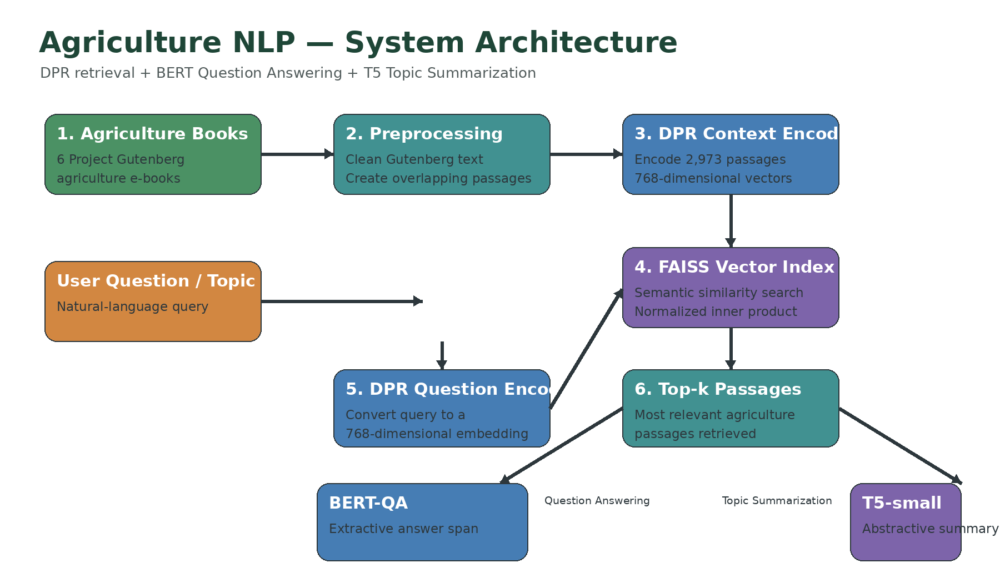
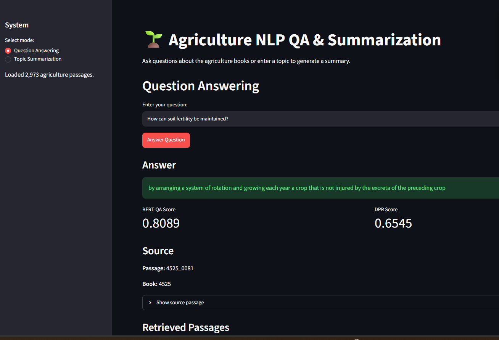
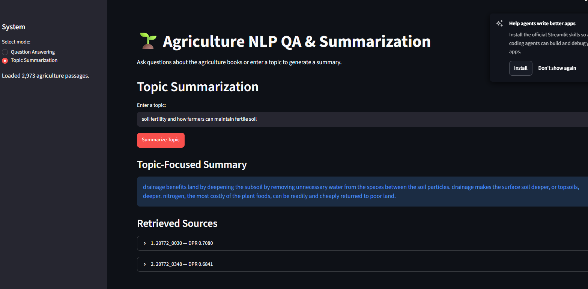

# 🌱 Agriculture NLP — Question Answering & Summarization

<p align="center">
  
</p>

<p align="center">
  <strong>An NLP system for question answering and topic summarization over agricultural e-books.</strong>
</p>

<p align="center">
  
  
  
  
  
  
</p>

---

## 📌 Overview

This project implements a natural language processing system for **question answering and topic summarization** over a collection of agriculture-related e-books from Project Gutenberg.

The system combines:

- **Dense Passage Retrieval (DPR)** for semantic passage retrieval
- **FAISS** for vector similarity search
- **BERT-based extractive Question Answering**
- **T5-small abstractive summarization**
- **Streamlit** for the interactive web interface

The project demonstrates an end-to-end retrieval and transformer-based NLP pipeline for working with domain-specific text.

---

## ✨ Features

| Feature | Description |
|---|---|
| 🔎 Semantic Retrieval | DPR retrieves passages based on semantic similarity |
| 📚 Multi-book Search | Searches across six agriculture e-books |
| ❓ Question Answering | BERT extracts answer spans from retrieved passages |
| 📝 Topic Summarization | T5 generates summaries from retrieved content |
| 🗂️ Vector Search | FAISS performs efficient similarity search |
| 🌐 Interactive UI | Streamlit provides a browser-based interface |
| 📖 Source Display | Retrieved passages and source books are shown to the user |

---

## 🏗️ System Architecture

<p align="center">
  
</p>

The system follows this workflow:

1. Agriculture e-books are collected and cleaned.
2. The cleaned text is divided into overlapping passages.
3. DPR creates dense representations for the passages.
4. FAISS stores and searches the passage embeddings.
5. A user question or topic is encoded using the DPR question encoder.
6. The most relevant passages are retrieved.
7. Retrieved passages are processed by either:
   - **BERT-QA** for extractive question answering, or
   - **T5-small** for abstractive topic summarization.
8. The Streamlit application displays the generated answer or summary together with source information.

---

## 📚 Dataset

The system uses six unique agriculture books from Project Gutenberg:

1. **Agriculture for Beginners**  
   Charles William Burkett, Frank Lincoln Stevens, and Daniel Harvey Hill

2. **Science and Practice in Farm Cultivation**  
   James Buckman

3. **The Farm That Won't Wear Out**  
   Cyril G. Hopkins

4. **Dry-Farming: A System of Agriculture for Countries under a Low Rainfall**  
   John Andreas Widtsoe

5. **Pleasant Talk About Fruits, Flowers and Farming**  
   Henry Ward Beecher

6. **Field, Forest and Farm**  
   Jean-Henri Fabre

One of the original assignment links was duplicated, so six unique books were processed.

### Dataset preparation

The original texts are:

- cleaned
- normalized
- divided into overlapping passages
- encoded into dense DPR vectors

The final dataset contains approximately **2,973 passages**.

Each passage contains approximately **200 words**, with a **50-word overlap** between consecutive passages.

---

## 🧹 Preprocessing

The preprocessing pipeline removes common Project Gutenberg formatting and metadata while preserving the book content.

Main steps:

1. Remove Project Gutenberg start and end markers
2. Remove production and transcription notes
3. Remove formatting artifacts
4. Normalize whitespace
5. Preserve the book text
6. Create overlapping passages

Implementation:

```text
src/preprocess.py
src/chunk_books.py
```

---

## 🔎 Dense Passage Retrieval

The project uses **Dense Passage Retrieval (DPR)** to retrieve passages relevant to a question or topic.

### Models

Question encoder:

```text
facebook/dpr-question_encoder-single-nq-base
```

Context encoder:

```text
facebook/dpr-ctx_encoder-single-nq-base
```

The passage encoder creates **768-dimensional** dense representations.

The question encoder maps the user's query into the same representation space. FAISS then searches the passage vectors using normalized inner-product similarity.

### Retrieval flow

```text
User Question / Topic
        ↓
DPR Question Encoder
        ↓
Question Embedding
        ↓
FAISS Similarity Search
        ↓
Top-k Relevant Passages
```

Generated files:

```text
data/dpr_passages.faiss
data/dpr_metadata.pkl
```

---

## ❓ Question Answering

The Question Answering pipeline combines DPR with a pretrained BERT-based extractive QA model.

### Model

```text
deepset/bert-base-cased-squad2
```

### Process

1. The user enters a question.
2. DPR retrieves relevant passages.
3. Each retrieved passage is provided to the BERT-QA model as context.
4. BERT predicts an answer span.
5. The highest-scoring extracted answer is displayed.
6. The source passage and book are displayed.

### Example

**Question**

```text
How can soil fertility be maintained?
```

The system can extract an answer such as:

```text
by arranging a system of rotation and growing each year a crop
that is not injured by the excreta of the preceding crop
```

The answer is an extractive span from the retrieved source text.

---

## 📝 Topic Summarization

The summarization pipeline combines DPR retrieval with **T5-small**.

### Model

```text
t5-small
```

### Process

1. The user enters a topic.
2. DPR retrieves relevant passages.
3. T5 generates a summary for each retrieved passage.
4. The generated summaries are combined.
5. T5 generates a final topic-focused summary.

This provides a retrieval-then-summarize workflow for agriculture-related topics.

---

## 🖥️ Application Screenshots

Add your actual Streamlit screenshots here.

### Question Answering

Save the screenshot as:

```text
assets/screenshots/question_answering.png
```

Then add:

```markdown

```

### Topic Summarization

Save the screenshot as:

```text
assets/screenshots/topic_summarization.png
```

Then add:

```markdown

```

---

## 🛠️ Technologies

| Technology | Purpose |
|---|---|
| Python | Main programming language |
| PyTorch | Deep learning framework |
| Hugging Face Transformers | Transformer models |
| DPR | Dense passage retrieval |
| BERT | Extractive question answering |
| T5 | Abstractive summarization |
| FAISS | Vector similarity search |
| Streamlit | Web application |
| NumPy | Numerical processing |

---

## 📁 Project Structure

```text
agriculture-nlp-qa-summarization/
│
├── assets/
│   ├── banner.png
│   ├── system_architecture.png
│   └── screenshots/
│       ├── question_answering.png
│       └── topic_summarization.png
│
├── data/
│   ├── raw/
│   ├── processed/
│   ├── passages.json
│   ├── dpr_passages.faiss
│   └── dpr_metadata.pkl
│
├── models/
├── notebooks/
│
├── src/
│   ├── app.py
│   ├── chunk_books.py
│   ├── dpr_retriever.py
│   ├── preprocess.py
│   ├── qa_system.py
│   ├── summarization_system.py
│   ├── test_bert_qa.py
│   ├── test_dpr.py
│   └── test_summarization.py
│
├── .gitignore
├── README.md
├── requirements.txt
└── requirements-freeze.txt
```

---

## ⚙️ Installation

Clone the repository:

```powershell
git clone https://github.com/chalithalumbini/agriculture-nlp-qa-summarization.git
cd agriculture-nlp-qa-summarization
```

Create a virtual environment:

```powershell
python -m venv .venv
```

Activate it on Windows PowerShell:

```powershell
.\.venv\Scripts\Activate.ps1
```

Install dependencies:

```powershell
pip install -r requirements.txt
```

---

## ▶️ Run the Application

From the project root:

```powershell
streamlit run src\app.py
```

Then open the local URL displayed by Streamlit, for example:

```text
http://localhost:8501
```

---

## 🧪 Test Individual Components

### Test DPR retrieval

```powershell
python src\test_dpr.py
```

### Test BERT Question Answering

```powershell
python src\test_bert_qa.py
```

### Test T5 summarization

```powershell
python src\test_summarization.py
```

---

## 📊 Current System

| Component | Implementation |
|---|---|
| Agriculture books | 6 |
| Passages | 2,973 |
| Passage size | ~200 words |
| Passage overlap | 50 words |
| DPR embedding size | 768 |
| Vector database | FAISS |
| Question Answering | BERT extractive QA |
| Summarization | T5-small |
| Interface | Streamlit |
| Runtime | CPU-compatible |

---

## ⚠️ Limitations

- The system uses pretrained models rather than models fine-tuned specifically on the agriculture books.
- BERT-QA is extractive and therefore selects answers from retrieved text.
- T5-small can produce simplified or incomplete summaries for complex passages.
- Retrieval quality depends on the DPR model and passage segmentation.
- The project does not currently include a formal benchmark evaluation against a manually labelled QA or summarization dataset.

---

## 🎯 Project Objective

The project demonstrates an end-to-end NLP workflow combining:

```text
Information Retrieval
        +
Transformer-based NLP
        +
Question Answering
        +
Abstractive Summarization
        +
Interactive Web Application
```

The goal is to make information contained in domain-specific agricultural texts easier to retrieve, question, and summarize through natural language interaction.

---

## 👤 Author

**Chalitha Lumbini**

MSc Statistical Data Analytics  
Tampere University, Finland

---

## 📄 License

This project is intended for educational and research purposes.

The agriculture texts are sourced from Project Gutenberg and are subject to the applicable terms and public-domain status of the individual works.
